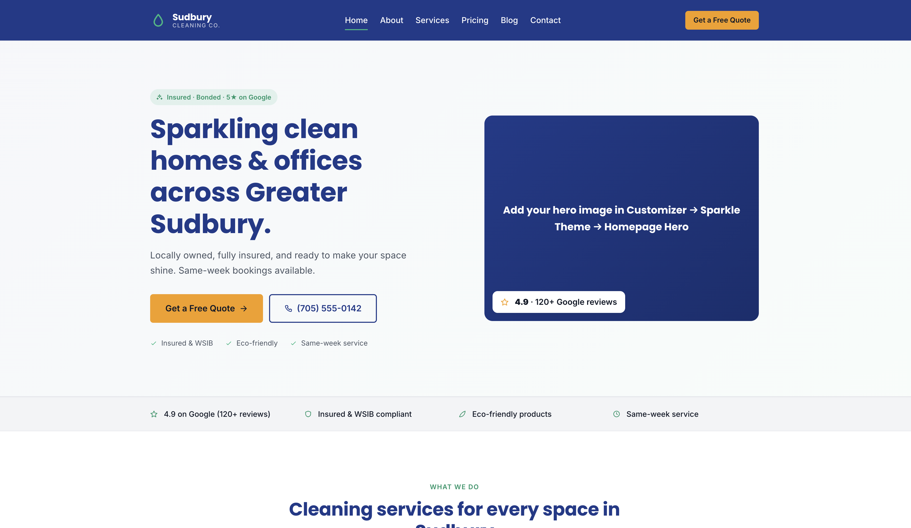
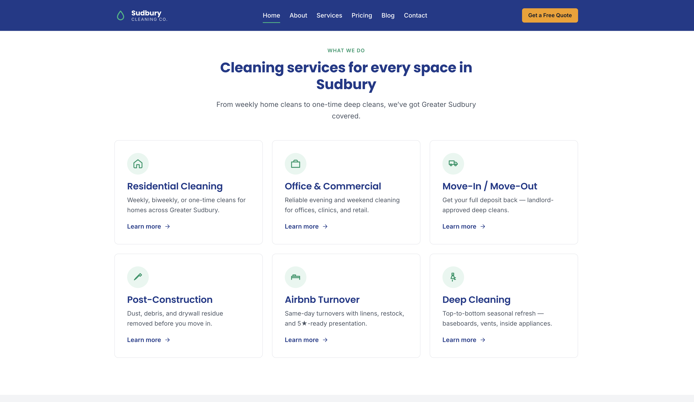
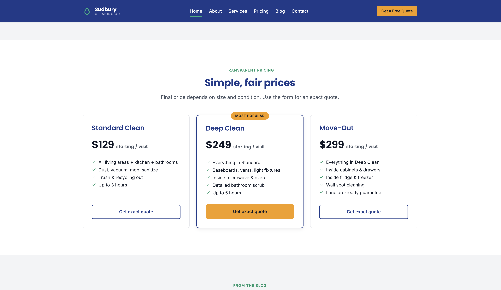
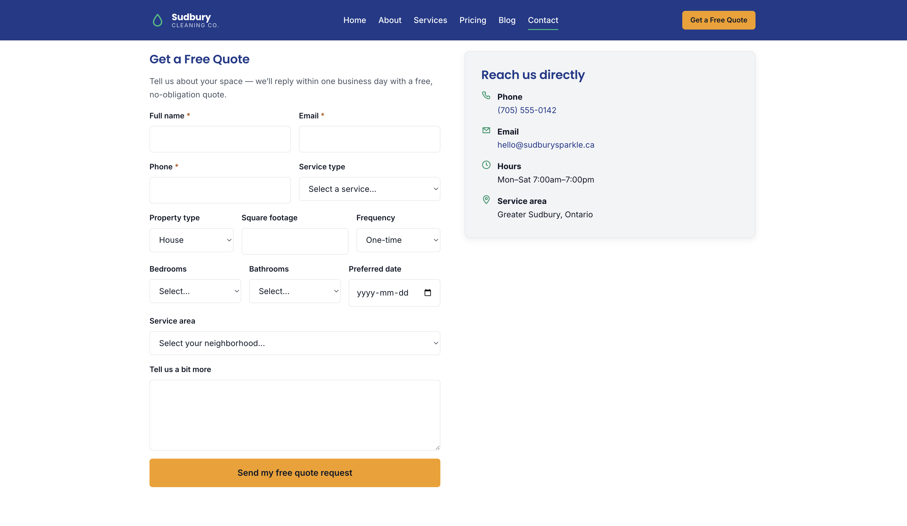
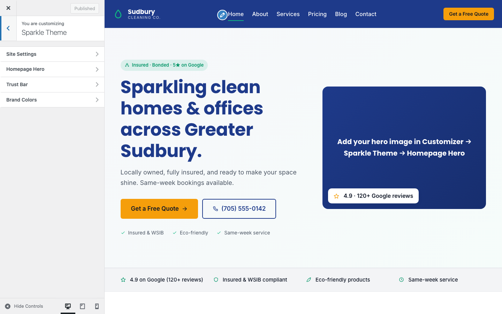
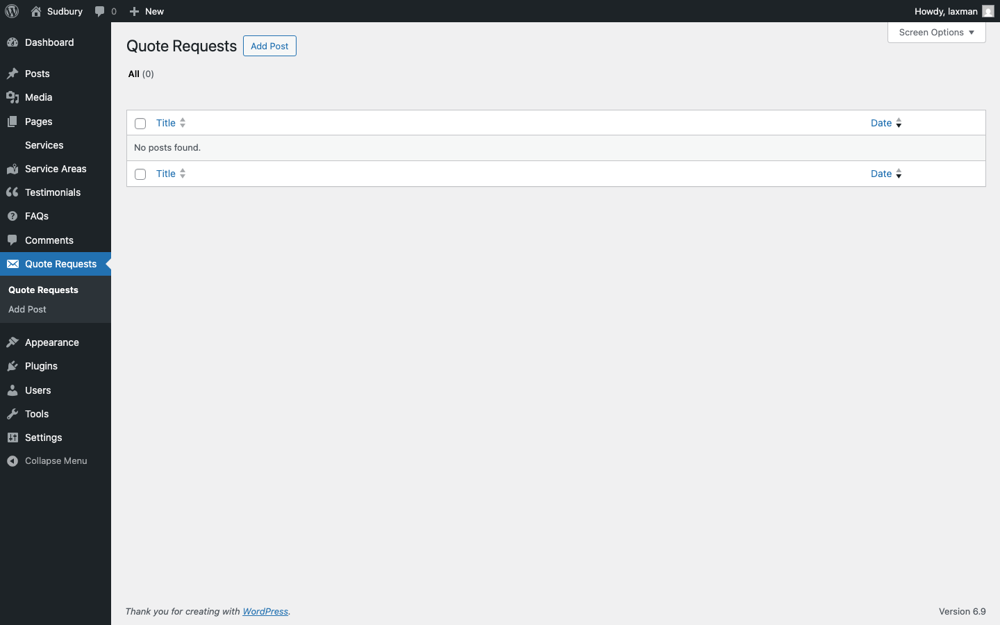

# Sudbury Cleaning — WordPress Theme + Plugins

> *Northern clean. Done right the first time.*

A custom WordPress build for a fictional Sudbury, Ontario cleaning service — split into one theme and three small plugins so the site survives theme switches and stays maintainable. No page builders, no premium plugins, no `node_modules`.

---

## Table of Contents

- [Overview](#overview)
- [Problem](#problem)
- [Solution](#solution)
- [Architecture — 1 theme + 3 plugins](#architecture--1-theme--3-plugins)
- [Features](#features)
- [Tech Stack](#tech-stack)
- [Project Structure](#project-structure)
- [Setup (Local Development)](#setup-local-development)
- [Day-to-day usage](#day-to-day-usage)
- [Key Implementation Details](#key-implementation-details)
- [Debugging](#debugging)
- [Troubleshooting](#troubleshooting)
- [Screenshots](#screenshots)
- [Future Improvements](#future-improvements)
- [Author](#author)

---

## Overview

Custom WordPress build that simulates a real local-business client project, with focus on **performance, maintainability, and clean UI**.

## Problem

Local service businesses overwhelmingly rely on heavy page builders (Elementor, Divi, WPBakery) and bloated multipurpose themes — and put all their content/functionality logic inside the theme. The result: slow page loads, fragile dashboards, and entire sites that break the moment a future maintainer switches themes.

## Solution

A lightweight custom theme written from scratch using only WordPress core APIs, paired with three single-purpose plugins that own the **data**, the **forms**, and the **SEO**. The theme is replaceable; the plugins are portable.

---

## Architecture — 1 theme + 3 plugins

```
wp-content/
├── themes/
│   └── sudbury-cleaning/        ← presentation only (templates, CSS, Customizer)
└── plugins/
    ├── sparkle-core/            ← content backbone (CPTs + taxonomies + helpers)
    ├── sparkle-forms/           ← [sparkle_quote_form] + handler
    └── sparkle-seo/             ← meta tags + JSON-LD schema
```

| Plugin | Owns |
|---|---|
| **Sparkle Core** | `service`, `area`, `testimonial`, `faq`, `quote_request` post types + `service_type` and `faq_topic` taxonomies + content fallback helpers |
| **Sparkle Forms** | `[sparkle_quote_form]` shortcode, server-side handler with nonce + honeypot + timestamp gate + IP rate limit + sanitization + CPT storage + owner email + customer auto-reply |
| **Sparkle SEO** | `<meta>` description, canonical, Open Graph, Twitter Card; JSON-LD `HouseCleaningService` (homepage), `Service` (service pages), `Article` (blog posts) |

**Theme** keeps only what's presentational: templates (`page-templates/`, `template-parts/`), CSS, brand-token system, the icon library, and Customizer settings (brand colors, hero text, contact info, trust-bar items).

If a future maintainer switches themes, all data, forms, and SEO keep working. Only the visual layer changes.

---

## Features

- **Custom homepage** with 12 hand-built sections (hero, trust bar, services grid, how-it-works, why-us, service areas, before/after, testimonials, pricing, blog preview, FAQ, CTA banner)
- **Per-neighborhood SEO landing pages** via `area` CPT (`/service-areas/sudbury/`, `/service-areas/lively/`, etc.)
- **Live-editable** hero, contact info, social URLs, trust-bar, brand colors via **Customizer → Sparkle Theme**
- **Auto-provisioning** — on first activation, theme creates all standard pages with their custom templates and a default Primary menu
- **Responsive, mobile-first** with sticky bottom CTA bar on mobile
- **Token-based design system** — colors, spacing, radius, motion as CSS custom properties
- **Plugin-dependency safety net** — admin notice tells you which companion plugin to activate if any are missing

---

## Tech Stack

- **WordPress** on **MySQL 8** (official `wordpress` Docker image — Apache + mod_php)
- **Docker + Docker Compose** for local development (self-contained — no host services required)
- **Adminer** for DB inspection
- **Vanilla CSS** (no Sass, no Tailwind), **vanilla JS** (no jQuery, no framework)
- **Google Fonts** — Poppins (headings) + Inter (body)
- **No build step**, no `node_modules`

---

## Project Structure

```
.
├── docker/
│   └── docker-compose.yml          WordPress + MySQL + Adminer
├── wp-content/
│   ├── plugins/
│   │   ├── sparkle-core/           CPTs + taxonomies + defaults
│   │   │   ├── sparkle-core.php
│   │   │   └── includes/cpts.php · quote-request.php · defaults.php
│   │   ├── sparkle-forms/          quote form
│   │   │   ├── sparkle-forms.php
│   │   │   └── includes/quote-form.php
│   │   └── sparkle-seo/            meta + schema
│   │       ├── sparkle-seo.php
│   │       └── includes/meta.php · schema.php
│   └── themes/
│       └── sudbury-cleaning/
│           ├── style.css           Theme header + brand tokens + base
│           ├── functions.php       Bootstraps inc/
│           ├── header.php · footer.php · front-page.php
│           ├── inc/                theme-setup, enqueue, helpers, customizer
│           ├── page-templates/
│           ├── template-parts/
│           └── assets/             css, js, images
├── README.md
└── .gitignore
```

---

## Setup (Local Development)

### Prerequisites
- Docker Desktop (or Docker Engine + Compose v2)

The stack is fully self-contained — MySQL runs as a service inside compose, no host-side database required.

### Run

1. Clone:
   ```bash
   git clone https://github.com/laxkc/sudbury-cleaning-wordpress-theme.git
   cd sudbury-cleaning-wordpress-theme
   ```

2. Start the stack:
   ```bash
   cd docker
   docker compose up -d
   ```

3. Open:

   | Service | URL |
   |---|---|
   | WordPress site | http://localhost:8080 |
   | Adminer (DB UI) | http://localhost:8083 |

4. Complete the WordPress install wizard.

5. **Activate the theme:** Appearance → Themes → *Sudbury Cleaning*

6. **Activate the plugins** (in this order — Forms depends on Core's `quote_request` post type):
   1. Plugins → *Sparkle Core* → Activate
   2. Plugins → *Sparkle Forms* → Activate
   3. Plugins → *Sparkle SEO* → Activate

7. Open **Customizer → Sparkle Theme** to set hero text, phone, email, social URLs, brand colors.

---

## Day-to-day usage

### Adding a service
**Services → Add New** → Title + Editor + Excerpt + Featured image. Auto-appears in homepage grid, `/services/` archive, footer, and the quote form's "Service type" dropdown.

### Adding a service area (for local SEO)
**Service Areas → Add New** → write 300+ words of locally relevant content. Renders at `/service-areas/[slug]/` and ranks for "house cleaning [neighborhood]" searches.

### Adding testimonials / FAQs
**Testimonials → Add New** for quotes (queried into homepage). **FAQs → Add New** for accordion items, with `faq_topic` taxonomy to group them.

### Reviewing quote submissions
**Quote Requests** → all submissions stored privately (never visible on the front end), with full meta box showing submitter info, IP, timestamp.

### Configuring email destination
**Customizer → Sparkle Theme → Site Settings → Quote Notification Email**. Falls back to WordPress admin email if empty.

---

## Key Implementation Details

### Contact Form (Sparkle Forms)
Built end-to-end without form plugins. Shortcode: `[sparkle_quote_form]`. Server-side flow:

1. WordPress nonce verification
2. Honeypot field check (spam trap)
3. Timestamp gate — reject submissions under 3 seconds
4. Per-IP rate limit (3 submissions/hour, transient-based)
5. Field sanitization with `sanitize_text_field`, `sanitize_email`, `absint`
6. Submission stored as a private `quote_request` CPT
7. Owner notification + customer auto-reply via `wp_mail()`
8. Redirect to `/thank-you/?quote=success`

### Template Hierarchy (Theme)
- `front-page.php` — homepage
- `archive-service.php` / `single-service.php` — services
- `archive-area.php` / `single-area.php` — service areas
- `archive.php` / `single.php` — blog
- `page-templates/` — assignable custom templates (about, contact, pricing, etc.)
- Falls back through `index.php` when no specific template matches

### Icon System (Theme)
Single source of truth: global rule `svg { width: 1em; height: 1em }` plus a reusable `.icon-label` / `.icon-label__icon` pattern. No per-icon CSS overrides, no `vertical-align` hacks. Standalone wrappers (logo, hamburger, social) control icon size via container `font-size`.

---

## Debugging

Debug mode is wired through one switch (`WORDPRESS_DEBUG` in compose) and split across two channels: PHP errors land in a host-readable file, JS errors land in the browser console.

### PHP / WordPress errors

Enabled by `WORDPRESS_DEBUG: 1` in `docker/docker-compose.yml`, which sets:

| Constant | Value | Effect |
|---|---|---|
| `WP_DEBUG` | `true` | Surfaces PHP notices/warnings/deprecations |
| `WP_DEBUG_LOG` | `/var/www/html/wp-content/logs/debug.log` | Writes errors to a host-mounted file |
| `WP_DEBUG_DISPLAY` | `false` | Keeps errors out of the rendered page |
| `SCRIPT_DEBUG` | `true` | Loads unminified WP core JS/CSS |

**Where to read:**
- WordPress-level errors → `wp-content/logs/debug.log` (host-readable, gitignored).
  ```bash
  tail -f wp-content/logs/debug.log
  ```
- Apache / MySQL / pre-WP-bootstrap errors → container stdout.
  ```bash
  cd docker && docker compose logs -f
  ```

The log is append-only; clear it with `: > wp-content/logs/debug.log` when it gets noisy.

### Frontend JavaScript logs

Same gate (`WP_DEBUG`), exposed to JS via `wp_localize_script` as `window.SudburySettings`. The theme creates a `window.sudbury` namespace with three methods that no-op when debug is off:

```js
sudbury.log('event_name', { context: 'value' });
sudbury.warn('event_name');
sudbury.error('event_name');
```

**Where to read:** browser dev-tools **Console** only — nothing is sent to the server or written to `debug.log`. Lines are tagged `[sudbury]` for grep-ability.

**What's logged today:**

| Trigger | Method | Event |
|---|---|---|
| JS executes on any page load | `log` | `theme_loaded` |
| User toggles the mobile drawer (open or close) | `log` | `mobile_menu_toggled` |
| Page has `.site-header` but no `.menu-toggle` / `#mobile-drawer` | `warn` | `mobile_menu_missing` |
| Page has `.faq-list` but no `.faq-q` buttons | `warn` | `faq_buttons_missing` |

### Toggling debug on/off

```yaml
# docker/docker-compose.yml
environment:
  WORDPRESS_DEBUG: 1   # 0 to disable
```
Then `cd docker && docker compose up -d` to apply.

**Always set this to `0` (or remove it) before deploying to anything that's not your laptop.** Debug output can leak file paths, SQL fragments, and internal state.

---

## Troubleshooting

| Symptom | Cause | Fix |
|---|---|---|
| 500 error after activating theme | Plugins not yet active | Activate all 3 in **wp-admin → Plugins** |
| Yellow admin notice "companion plugin(s) required" | One or more plugins inactive | Activate the named plugins |
| `[sparkle_quote_form]` shows as literal text | Sparkle Forms inactive | Activate it |
| 404 on `/services/` or `/service-areas/` | Permalinks need flushing | **Settings → Permalinks** → *Save* |
| Service entries not appearing in homepage grid | No services added yet | Create at least one in **Services → Add New** (defaults render until then) |
| `wp-content/logs/debug.log` not appearing | `WORDPRESS_DEBUG` is off, or the host `wp-content/logs/` directory was deleted | Set `WORDPRESS_DEBUG: 1` in compose, recreate the dir, `docker compose up -d` |
| `[sudbury]` lines missing in browser console | Stale cached `main.js`, or `SudburySettings.debug` is false | Hard-reload (Cmd/Ctrl + Shift + R), confirm `window.sudbury.debug === true` in the console |

---

## Screenshots

All screenshots live in `wp-content/themes/sudbury-cleaning/assets/images/screenshots/`.

### Homepage


### Homepage — mobile


### Services page


### Pricing page


### Contact / Quote form


### Customizer — Sparkle Theme panel


### Quote Requests admin (CPT inbox)


---

## Future Improvements

- Booking calendar with available time slots
- Online payment integration (Stripe) for booking deposits
- Bilingual support (English / French) — Sudbury is officially bilingual
- WP REST API endpoints for a headless frontend
- Object caching + page caching layer
- WP-CLI seed command for fast demo provisioning

---

## Author

**Laxman KC**

- GitHub: [@laxkc](https://github.com/laxkc)
- LinkedIn: [linkedin.com/in/laxmankc](https://www.linkedin.com/in/laxmankc/)
